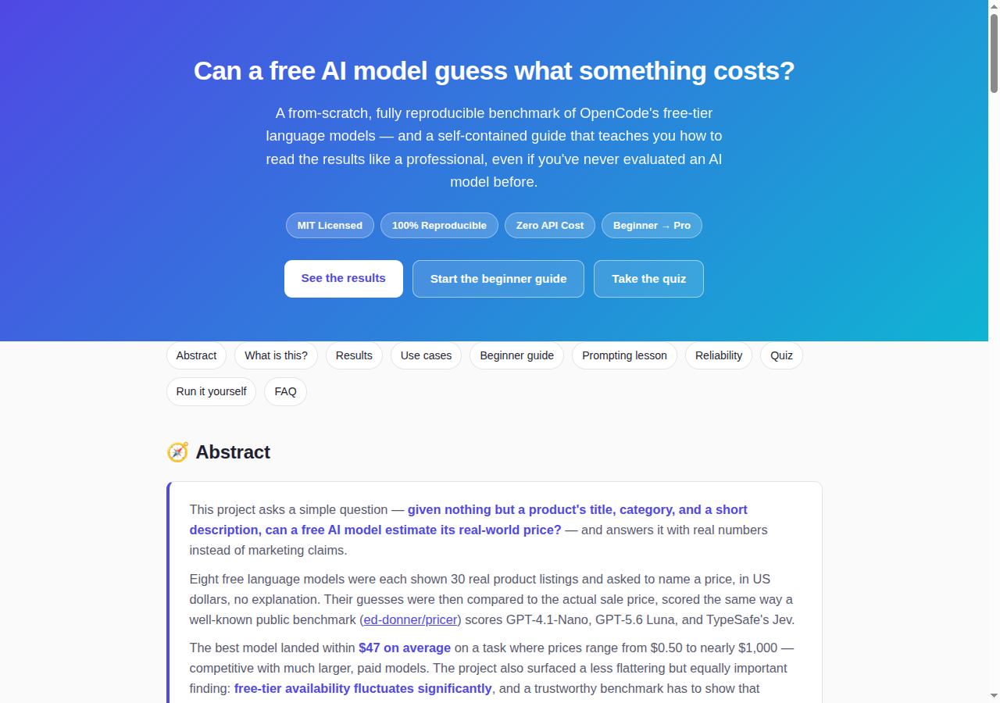
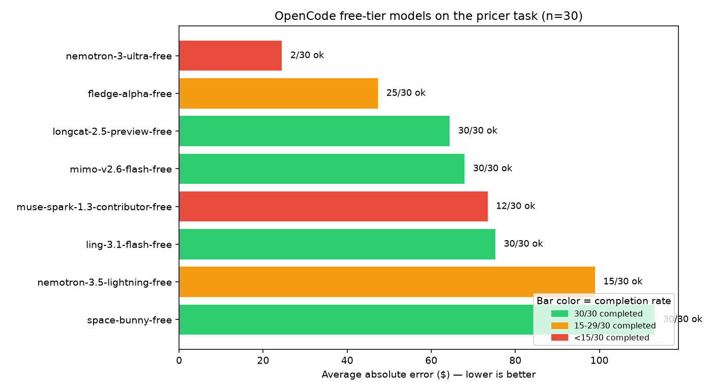
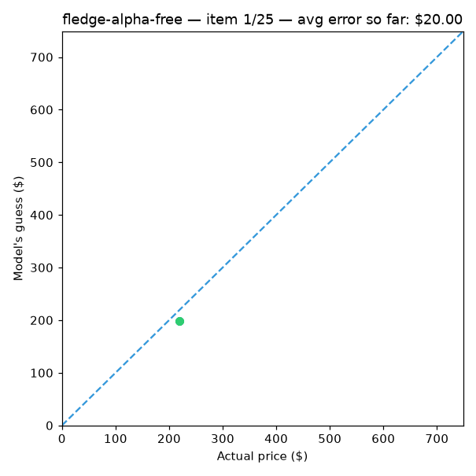

# OpenCode Free-Tier Model Pricer Bench

  

**Can a free AI model guess what something costs?** A fully reproducible benchmark of nine free-tier language models on a real price-estimation task, plus a from-scratch, beginner-to-professional guide explaining exactly how to read the results — written so that literally anyone, with zero prior AI experience, can understand every number on this page.

📊 **[Open the interactive results page](./preview.html)** — charts, an animated prediction build-up, and a self-grading quiz, all in one page. (See [Hosting this page live](#hosting-this-page-live) to view it as a real website instead of a local file.)

<p align="center">
  
</p>

<a id="toc"></a>
## Table of contents

- [Executive summary](#executive-summary)
- [What is this, in plain English](#what-is-this-in-plain-english)
- [The task](#the-task)
- [Why a separate script instead of the original notebook](#why-a-separate-script-instead-of-the-original-notebook)
- [Results (n=30 per model)](#results-n30-per-model)
- [Run-to-run reliability](#run-to-run-reliability)
- [One rate-limit lesson worth keeping](#one-rate-limit-lesson-worth-keeping)
- [🌱 Beginner guide — read this and you are a professional](#-beginner-guide--read-this-and-you-are-a-professional)
- [A real lesson in prompt design](#a-real-lesson-in-prompt-design)
- [What can you use this repo for](#what-can-you-use-this-repo-for)
- [Reproducing](#reproducing)
- [Hosting this page live](#hosting-this-page-live)
- [Caveats](#caveats)
- [FAQ](#faq)
- [Credits](#credits)

---

## Executive summary

Nine free AI models were each asked to look at a short product description — nothing else, no catalog, no internet access — and guess its real-world price in US dollars. Their guesses were scored against the actual sale price of real Amazon listings, using the exact same methodology a well-known public benchmark uses to score GPT-4.1-Nano, GPT-5.6 Luna, and TypeSafe's Jev.

**The headline result:** the best-performing free model landed within **$47 on average** on items ranging from $0.50 to nearly $1,000 — squarely competitive with much larger, paid models. **The less flattering but more important result:** free-tier availability is volatile. The same models, tested three separate times under near-identical conditions, swung from 2-of-9 models completing cleanly to 8-of-8 completing cleanly to 3-of-8 completing cleanly. A benchmark that only reports the good run isn't a benchmark — it's marketing. This one reports all three.

Everything in this repository — every chart, every number, every claim — traces back to a CSV file you can open and check yourself. Nothing is simulated, estimated, or rounded for effect.

[↑ Back to top](#toc)

## What is this, in plain English?

If you've never worked with AI language models before, here's the short version:

1. **The task** — Give an AI a product description (title, category, brand, one-sentence summary) and ask it to guess the price. No hints, no lookup table — just whatever the model picked up during training about what things like this typically cost.
2. **The scoring** — Since we already know the real price, we can measure exactly how far off each guess was, averaged across 30 different products per model.
3. **The models** — Instead of paying for a premium API, this project uses nine models currently offered *for free*, and asks the uncomfortable question: are they actually good, and can you actually depend on them?
4. **The honesty check** — Free things are often unreliable. So the same test was run multiple times, and this README reports *how often each model even finished the job*, not just how accurate it was when it did.

If that's all you needed, you can stop here. If you want to understand every metric and term well enough to explain it to someone else, jump to the [🌱 Beginner guide](#-beginner-guide--read-this-and-you-are-a-professional) — by the end of it you'll know more than most interview candidates asked to explain "how do you evaluate a model."

[↑ Back to top](#toc)

## The task

Given a product description (title, category, brand, a one-sentence summary),
ask a model: *"Estimate the price of this product. Respond with the price, no
explanation."* Score the guess against the real price from a held-out test set
of ~10,000 Amazon listings.

Dataset, prompt, and metrics (average absolute error, MSE, r²) are taken as-is
from `ed-donner/pricer`'s `lab.ipynb` / `pricer/evaluator.py`, so results here
are directly comparable to that notebook's reported numbers for GPT-4.1-Nano,
GPT-5.6 Luna, and Jev.

[↑ Back to top](#toc)

## Why a separate script instead of the original notebook

The original notebook calls models through litellm/OpenRouter — a bare chat
completion. OpenCode's free-tier models reject that: a request with tool
definitions stripped out gets a `403 FreeTierError`:

> "OpenCode's free tier can only be used from within OpenCode"

A custom `system` prompt override is fine; it's specifically disabling `tools`
that trips the gate (confirmed by isolating the two in separate test calls).
So `benchmark.py` talks to a locally running `opencode serve` over its HTTP API
with the normal agent tool-calling context intact, just with a system prompt
override to keep responses terse.

**Practical consequence:** every call carries real agent-context overhead
(tens of seconds per call, even for a one-line answer), so latency numbers
here are *not* comparable to the original notebook's sub-second OpenRouter
timings. Cost is a clean $0 across the board either way (free tier), so cost
comparisons aren't meaningful here.

[↑ Back to top](#toc)

## Results (n=30 per model)

First 30 items of the `ed-donner/items_full` test split, same selection the
original notebook uses by default (`evaluate(predictor, test)` scores the
first `size` items). Raw data backing this table is in `results/summary.csv`
and `results/<model>.csv` (per-item title/truth/guess/error/latency), with
`results/<model>.png` scatter plots.

**This table is from a single run, and that run had significant request
attrition — read the [Run-to-run reliability](#run-to-run-reliability)
section below before trusting any row with a low OK count.**

<p align="center">
  
</p>

<p align="center">
  
  <br/><sub>Real per-item data from <code>results/fledge-alpha-free.csv</code>, animated — every point is an actual model response.</sub>
</p>

| Model | OK/30 | Avg Error | MSE | r² | Avg Latency |
|---|---|---|---|---|---|
| `fledge-alpha-free` | 25 | $47.31 | 5,805 | 78.9% | 56.6s |
| `longcat-2.5-preview-free` | 30 | $64.39 | 9,209 | 64.8% | 58.8s |
| `mimo-v2.6-flash-free` | 30 | $67.93 | 11,325 | 56.7% | 37.3s |
| `muse-spark-1.3-contributor-free` | 12 | $73.39 | 12,004 | 58.2% | 58.5s |
| `ling-3.1-flash-free` | 30 | $75.25 | 11,022 | 57.8% | 72.1s |
| `nemotron-3.5-lightning-free` | 15 | $98.92 | 28,885 | -25.1% | 95.9s |
| `space-bunny-free` | 30 | $113.16 | 34,995 | -33.9% | 38.4s |
| `nemotron-3-ultra-free` | 2 | $24.48 | 829 | -428.9% | 89.7s |

`nemotron-3-ultra-free`'s $24.48 looks great until you notice it's from 2
successful calls out of 30 — not a usable signal, just luck. Don't rank by
this table alone; cross-check the OK column and, ideally, re-run yourself.

[↑ Back to top](#toc)

## Run-to-run reliability

Three independent sweeps of (mostly) the same 8-9 models, same 30 items,
run hours apart:

| Run | Conditions | Clean (30/30) models | Notes |
|---|---|---|---|
| 1 | Initial network path, 5 workers, 90s timeout, no retry | 2 of 9 | `ling-3.0-flash-fin-free` permanently dead (routing error); several others 20-100% timeout |
| 2 | After a VPN change, 4 workers, 150s timeout, 1 retry | **8 of 8** | Every model 30/30, zero failures — the numbers quoted earlier in this project's development |
| 3 (committed here) | Same as run 2, different time of day | 3 of 8 | Backend-side degradation unrelated to network path — `nemotron-3-ultra-free` alone took 38 minutes for 30 items and got 2 through |

Run 2's clean numbers, for reference (not in `results/`, but worth knowing):
`muse-spark-1.3-contributor-free` $34.84 (r²=87.6%), `nemotron-3-ultra-free`
$50.04 (r²=71.6%), `fledge-alpha-free` $55.27 (r²=73.4%), `mimo-v2.6-flash-free`
$63.56 (r²=59.7%), `longcat-2.5-preview-free` $64.01 (r²=67.2%),
`ling-3.1-flash-free` $70.85 (r²=59.1%), `nemotron-3.5-lightning-free` $93.65
(r²=-58.1%), `space-bunny-free` $126.27 (r²=-24.3%).

**Takeaway: these models' availability and latency fluctuate significantly
run to run, independent of which network path you're on.** Treat any single
run's numbers as a snapshot of that moment, not a stable ranking. If you're
evaluating these models for real use, run this more than once before drawing
conclusions, and watch the OK/30 column as closely as the error column.

For reference, the original notebook reports (n=200, via OpenRouter):

| Model | Avg Error | Cost per 1k | Latency |
|---|---|---|---|
| GPT-4.1-Nano | $68.00 | $0.012 | ~879ms |
| GPT-5.6 Luna (no reasoning) | $54.91 | $0.030 | ~950ms |
| Jev (single pass) | $58.78 | $0.080 | 264ms |
| Jev (two-pass median) | ~$54 | $0.100 | 238ms |

[↑ Back to top](#toc)

## One rate-limit lesson worth keeping

The first full sweep (also n=30, 5 workers) had heavy attrition — several
models timed out on 20-80% of calls. Switching network paths (a VPN change)
and re-running with a longer per-call timeout, one retry on transient errors,
and slightly lower concurrency (4 workers) brought every model to a clean
30/30. One model, `ling-3.0-flash-fin-free`, is excluded entirely: its
failures were consistently `Not Found: Cannot find any route matching
[POST]...` — a routing/delisting error, not a timeout, confirmed in isolated
retests. It's simply not reachable right now, regardless of network path.

[↑ Back to top](#toc)

## 🌱 Beginner guide — read this and you are a professional

Everything below assumes you know nothing about AI model evaluation yet. Read it end to end and you will know more than most interview candidates asked to explain how to evaluate an AI model.

### What is a "model" here?

A language model is software trained on huge amounts of text that can answer questions, write text, or — as in this project — make an estimate. "Free-tier" just means the provider lets you use it without paying, usually with some limit on how much or how fast you can use it.

### What does the model actually see?

For every product, the model receives a short, cleaned-up description — title, category, brand, and a one-sentence summary — and this exact instruction:

```text
Estimate the price of this product. Respond with the price, no explanation.
```

That's it. No catalog, no internet access, no hints. It has to rely entirely on whatever it learned during training about what things like this typically cost.

### How do you measure if a guess is "good"?

**Average error (MAE — Mean Absolute Error).** Take every guess, subtract the real price, ignore whether it was too high or too low, and average all those differences. An average error of **$47** means: across 30 different products, the guesses were off by $47 on average. Lower is better, and it's the easiest number to explain to a non-technical person.

**MSE (Mean Squared Error).** Like average error, but each mistake is squared before averaging. Squaring punishes big misses far harder than small ones — being off by $200 counts 100&times; worse than being off by $20, not 10&times; worse. Useful when a few huge mistakes matter more to you than many small ones.

**r² ("r-squared").** This answers: "compared to just guessing the *average price* every single time, how much better is this model actually doing?"
- **r² near 100%** — the model is tracking real prices closely.
- **r² near 0%** — the model is doing about as well as always guessing the dataset's average price. Not impressive.
- **r² below 0%** (yes, this happens twice in this dataset) — the model is doing *worse* than guessing the same average number every time, ignoring the product entirely.

**Completion rate (OK / 30).** Before trusting any accuracy number, check how many of the 30 requests actually succeeded. A model that completed only 2 of 30 requests and happened to get both close will show a great "average error" that means almost nothing — this is [survivorship bias](https://en.wikipedia.org/wiki/Survivorship_bias), one of the most common ways a benchmark misleads people.

**Latency.** How long, in seconds, it took to get an answer back. Specific caveat for this project: these free models can only be reached through a full AI-agent request (see [Why a separate script](#why-a-separate-script-instead-of-the-original-notebook)), which adds real overhead — these latency numbers measure something different from a bare, stripped-down API call to a paid model.

### Why does the same model get different scores in different runs?

Two reasons. First, many of these models have some randomness built in, so the exact same question can get a slightly different answer each time. Second — and this turned out to be the bigger factor here — free-tier backends can be under heavier or lighter load depending on when you run the test, which changes how many requests time out. See [Run-to-run reliability](#run-to-run-reliability) above for real evidence of this.

[↑ Back to top](#toc)

## A real lesson in prompt design

One of the most-cited findings in AI research is almost absurdly simple: appending a short phrase to a question can make a model "think" before answering and measurably improve its accuracy on reasoning problems — without giving it a single worked example. Kojima et al. (2022), in the paper that introduced zero-shot chain-of-thought prompting, tested several trigger phrases and found this one performed best:

> "Let's work this out in a step-by-step way to be sure we have the right answer."

This project **deliberately does the opposite**. The prompt explicitly says *"no explanation"* and asks for just a number. Why? Because this benchmark measures quick, instinctive estimation — closer to what a human expert glances at and guesses than a problem that benefits from showing its work. Step-by-step reasoning tends to cost more tokens, more time, and more money, and for a task this simple it may not even improve the answer.

**Try it yourself:** fork this repo, add the step-by-step phrase to `SYSTEM_PROMPT` in `benchmark.py`, and re-run. Does accuracy improve enough to justify several times the latency and token cost? That tradeoff — reasoning quality vs. speed vs. cost — is one of the most practical skills in working with AI models.

[↑ Back to top](#toc)

## What can you use this repo for?

- **Benchmark your own models** — swap in any model ID your own AI provider exposes and get the same error/latency/reliability scoreboard, for free, with one command.
- **Learn AI evaluation from scratch** — the [beginner guide](#-beginner-guide--read-this-and-you-are-a-professional) above walks through every metric used here, no prior data-science background assumed.
- **Stress-test a "free tier" before depending on it** — the multi-run reliability data is a template for finding out whether a free API is actually production-ready before you build on it.
- **Reuse it as a template for your own benchmark** — the scoring harness, CSV logging, chart generation, and the interactive results page are all generic; point them at a different task and dataset and reuse the whole pipeline.
- **Teach or learn prompt design** — the [prompting lesson](#a-real-lesson-in-prompt-design) above uses a real, citable example to show how the exact wording of a prompt changes cost, speed, and accuracy.
- **Interview preparation** — read the beginner guide and the interactive quiz end to end and you'll be able to speak fluently about MAE, r², rate limiting, and evaluation bias.

[↑ Back to top](#toc)

## Reproducing

```bash
pip install -r requirements.txt

# in another terminal, or however you run it:
opencode serve --port 4096

python3 benchmark.py --size 30 --workers 4

# regenerate the README/preview.html charts and GIF from fresh results
python3 scripts/make_assets.py
```

`--models` takes any subset of the model IDs in `benchmark.py`'s `FREE_MODELS`
list; `--size` controls how many test items to score (the original notebook's
default is 200, which takes considerably longer at these per-call latencies).

[↑ Back to top](#toc)

## Hosting this page live

`preview.html` (mirrored as `index.html`) is a self-contained page — no build step, no external dependencies beyond a system font. To serve it as an actual website instead of a local file:

1. Push this repository to GitHub.
2. Go to **Settings → Pages**.
3. Under **Build and deployment**, set **Source** to **Deploy from a branch**.
4. Choose the branch (usually `main`) and the folder (**/ (root)**), then **Save**.
5. GitHub builds and publishes the site at `https://<your-username>.github.io/<repo-name>/` within a minute or two — `index.html` is served automatically at that root URL.

No GitHub Actions workflow is needed for a page this simple; "Deploy from a branch" is the right tool here, and it redeploys automatically on every push to that branch.

[↑ Back to top](#toc)

## Caveats

- n=30 is enough to rank models, not to pin down exact dollar figures to the
  cent — scale up `--size` for tighter confidence intervals.
- These are free-tier models; availability, routing, and even which models are
  listed as free can change without notice.
- The agent-context tax on latency (see above) means this setup is good for
  an accuracy comparison, not a speed comparison.

[↑ Back to top](#toc)

## FAQ

**Why can't you just call these models with a normal, lightweight API request?**
They're gated behind a full agent runtime. A request with the tool-calling context stripped out gets rejected outright — confirmed by isolating that setting from a custom system-prompt override in separate test calls. Practical effect: every call here carries real overhead, unlike a bare completion call to a paid model.

**Is $0 cost really $0, no catch?**
Within this benchmark, yes — every call returned a cost of exactly $0.00. Free-tier terms can change; availability (see [Run-to-run reliability](#run-to-run-reliability)) is the real cost, in the form of your own time spent on retries and failed calls.

**Why exclude one of the nine models entirely?**
`ling-3.0-flash-fin-free` consistently returned a routing error ("no route matching") rather than a timeout — a sign it's been removed or renamed on the provider's side, not something a retry can fix. Confirmed broken in isolated re-tests before being excluded.

**Can I trust the exact dollar figures?**
Trust the *ranking* more than the exact numbers. With 30 items per model, there's enough signal to say "model A is clearly better than model B," not enough to say "model A is exactly $3.12 better." Scale up `--size` for tighter numbers.

[↑ Back to top](#toc)

## Credits

- Task, dataset, and evaluation methodology: [ed-donner/pricer](https://github.com/ed-donner/pricer)
- Models: whatever's currently listed under the `opencode` provider's free tier
- Zero-shot chain-of-thought trigger phrase and finding: Kojima et al., *"Large Language Models are Zero-Shot Reasoners"* (2022)

[↑ Back to top](#toc)
